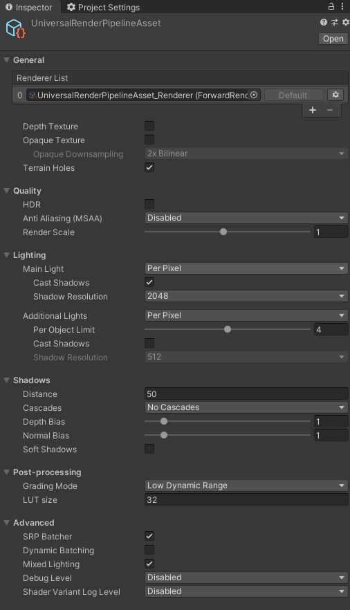
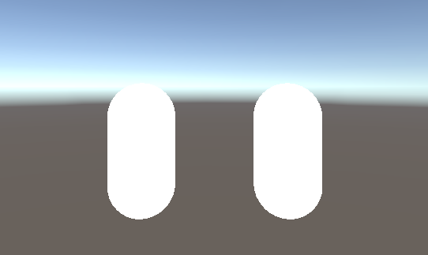

## 什么是URP

### SRP

在弄明白URP之前，我们要弄明白什么是SRP？

Unity 的**可编程渲染管线 (Scriptable Render Pipeline, SRP)** 是一项可以通过 C# 脚本来控制渲染的功能。SRP 技术可以强化为**通用渲染管线 (URP)** 和**高清渲染管线 (HDRP)**。

当前在Unity开发中面对不同的平台，需要实现不同的渲染效果和渲染管线。针对移动平台，需要的是性能，不需要物理光照渲染等等，这时候我们需要的是一个低配的渲染管线。争对PC或者主机平台，要求高级渲染，光线追踪、屏幕后处理等等，所以，需要的是一个高级的渲染管线。在这两种情况下，Unity基本的渲染管线**Built-in**都无法满足，所以**SRP**因此而生。

### URP和HDRP

开发渲染管线是极其困难的，至少对于大部分人来说，去接触管线都是不太合理的。所以Unity提供了两个开发好的管线，**URP**和**HDRP**，URP针对的主要是手机游戏，PC端的中小型游戏，而HDRP则针对3A级游戏开发。

## URP安装

1. 安装UPR，点击Window->Package Manager->All Packages，搜索**Universal RP**然后进行安装即可

2. 创建渲染管线，在Assets资源文件夹下右击，选择 Create->Rendering->Universal Render Pipeline->Pipeline Asset(Forward Renderer)。

3. 设置渲染管线，点击Edit->Project Settings->Graphics，在Scriptable Render Pipeline Settings中选择我们刚刚创建的渲染管线

4. 点击我们所创建的渲染管道，可以在Inspector面板中看到各种对渲染的设置选项

   

   

   

## Shader变化

在老版本的BRP渲染管线中，我们使用的是以**CG**语言开发的Shader，而在新版本的URP管线中，虽然**CG**语言依然可以使用，但是建议使用的是**HLSL**语言。原因很简单，**CG**语言已经很久没有维护了，而**HLSL**是微软所开发的语言，一直保持更新，所以在不久的将来，**CG**被去除是必然的趋势。

现在我们使用两种不同的语言编写一个无光照的Shader，来看看语法上发生了哪些改变。

- BRP

```glsl
Shader "Built-in/Unlit"
{
    /*一个基础的着色器*/
    Properties
    {
        _MainTex ("Base Texture", 2D) = "white" {} 
        _BaseColor("Base Color",Color)=(1,1,1,1)
    }
        
    SubShader
    {
        Tags { "RenderType" = "Opaque" }
        
		CGINCLUDE    
		float4 _BaseColor;
		float4 _MainTex_ST;
		sampler2D _MainTex;

		struct a2v
		{
			float4 positionOS : POSITION;
			float2 texcoord : TEXCOORD;
		};

		struct v2f
		{
			float4 positionCS : SV_POSITION;
			float2 texcoord : TEXCOORD;
		};

		ENDCG

        Pass
        {
            CGPROGRAM
            
            #pragma vertex vert
            #pragma fragment frag
			
			#include "UnityCG.cginc"
			
			v2f vert(a2v i)
			{
				v2f o;
				o.positionCS = UnityObjectToClipPos(i.positionOS);
				o.texcoord = TRANSFORM_TEX(i.texcoord, _MainTex);
				return o;
    		}
    
			half4 frag(v2f i): SV_Target
			{
				half4 mainTex = tex2D(_MainTex, i.texcoord);
				return _BaseColor * mainTex;
			}
			
            ENDCG         
        }
    }
}
```

- URP

```glsl
Shader "URP/URPUnlitShader"
{
    Properties
    {
		// 属性定义没有改变
        _MainTex ("Base Texture", 2D) = "white" {} 
        _BaseColor("Base Color",Color)=(1,1,1,1)
    }
    SubShader
    {
        Tags 
        { 
			// Tags 会多出URP特有的 一些Tags 这里也要在Tags中声明，使用URP。
			// subshader下的 tags 适用于所有Pass
            "RenderPipeline"="UniversalRenderPipeline"
            "RenderType"="Opaque" 
        }

        HLSLINCLUDE // CGINCLUDE
        #include "Packages/com.unity.render-pipelines.universal/ShaderLibrary/Core.hlsl"

        //CBUFFER(常量缓冲区)的空间较小,不适合存放纹理贴图这种大量数据的数据类型，适合存放float，half之类的不占空间的数据
        CBUFFER_START(UnityPerMaterial)
        float4 _MainTex_ST;//ST = Sampler Texture 采样器纹理，如果要进行纹理采样，必须声明对应的_ST。
        half4 _BaseColor;
        CBUFFER_END

        struct a2v//这就是a2v 应用阶段传递模型给顶点着色器的数据
        {
            float4 positionOS : POSITION;
            float2 texcoord : TEXCOORD;
        };

        struct v2f//这就是v2f 顶点着色器传递给片元着色器的数据
        {
            float4 positionCS : SV_POSITION;//必须
            float2 texcoord : TEXCOORD;
        };

        //新的DXD11 HLSL贴图的采样函数和采样器函数，TEXTURE2D (_MainTex)和SAMPLER(sampler_MainTex)，用来定义采样贴图和采样状态代替原来DXD9的sampler2D
        TEXTURE2D(_MainTex);
        SAMPLER(sampler_MainTex);

        ENDHLSL //ENDCG

        Pass
        {        
            HLSLPROGRAM //CGPROGRAM
            #pragma vertex vert
            #pragma fragment frag

            v2f vert(a2v i)
            {
                v2f o;
				//在CG里面，模型空间坐标转齐次坐标 o.vertex = UnityObjectToClipPos(v.vertex);
                o.positionCS = TransformObjectToHClip(i.positionOS.xyz);
                o.texcoord=TRANSFORM_TEX(i.texcoord,_MainTex);
                return o;
            }

            float4 frag(v2f i):SV_Target
            {
                // 贴图的采用输出函数采用DXD11 HLSL下的 SAMPLE_TEXTURE2D(textureName, samplerName, coord2) ，
                // 具有三个变量，分别是TEXTURE2D (_MainTex)的变量和SAMPLER(sampler_MainTex)的变量和uv，
                // 用来代替原本DXD9的TEX2D(_MainTex,texcoord)。

                half4 mainTex = SAMPLE_TEXTURE2D(_MainTex, sampler_MainTex, i.texcoord);                
                return mainTex * _BaseColor;
            }
            ENDHLSL  // NDCG
        }
    }
}
```

可以看出在编码逻辑上没有什么区别，主要是语法的不同，以及引用了不同的函数库。两个Shader效果上看不出任何区别。




## 引用
- https://fungusfox.gitee.io/p/urp%E5%88%9D%E8%AF%95/