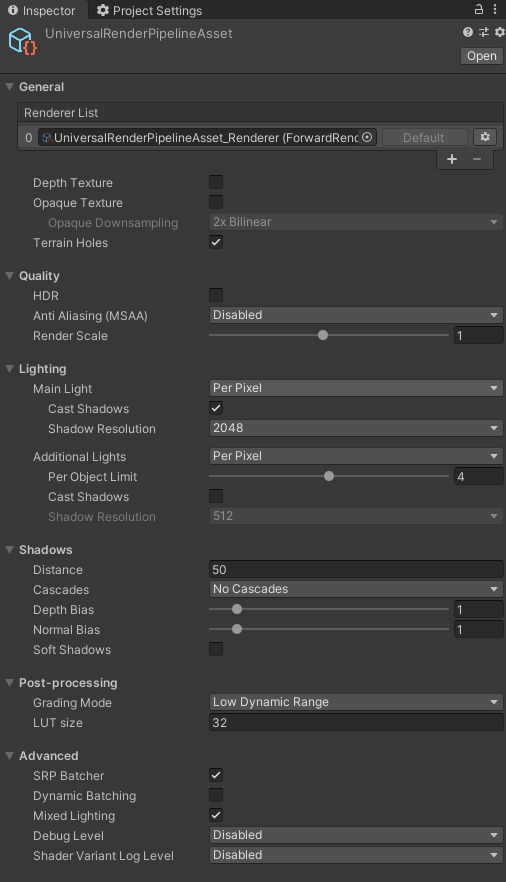
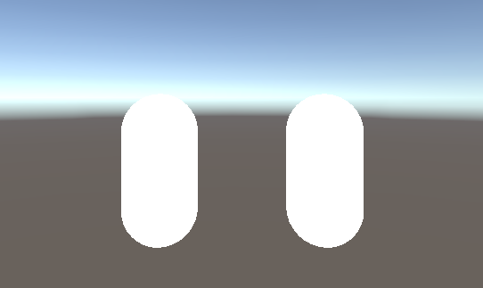

## 什么是URP

### SRP

在弄明白URP之前，我们要弄明白什么是SRP？

Unity 的**可编程渲染管线 (Scriptable Render Pipeline, SRP)** 是一项可以通过 C# 脚本来控制渲染的功能。SRP 技术可以强化为**通用渲染管线 (URP)** 和**高清渲染管线 (HDRP)**。

当前在Unity开发中面对不同的平台，需要实现不同的渲染效果和渲染管线。针对移动平台，需要的是性能，不需要物理光照渲染等等，这时候我们需要的是一个低配的渲染管线。争对PC或者主机平台，要求高级渲染，光线追踪、屏幕后处理等等，所以，需要的是一个高级的渲染管线。在这两种情况下，Unity基本的渲染管线**Built-in**都无法满足，所以**SRP**因此而生。

### URP和HDRP

开发渲染管线是极其困难的，至少对于大部分人来说，去接触管线都是不太合理的。所以Unity提供了两个开发好的管线，**URP**和**HDRP**，URP针对的主要是手机游戏，PC端的中小型游戏，而HDRP则针对3A级游戏开发。

## URP安装

1. 安装UPR，点击Window->Package Manager->All Packages，搜索**Universal RP**然后进行安装即可

2. 创建渲染管线，在Assets资源文件夹下右击，选择 Create->Rendering->Universal Render Pipeline->Pipeline Asset(Forward Renderer)。

3. 设置渲染管线，点击Edit->Project Settings->Graphics，在Scriptable Render Pipeline Settings中选择我们刚刚创建的渲染管线

4. 点击我们所创建的渲染管道，可以在Inspector面板中看到各种对渲染的设置选项

   

   [](https://fungusfox.gitee.io/p/urp初试/index.assets/image-20201203112000618.png)

   

## Shader变化

在老版本的BRP渲染管线中，我们使用的是以**CG**语言开发的Shader，而在新版本的URP管线中，虽然**CG**语言依然可以使用，但是建议使用的是**HLSL**语言。原因很简单，**CG**语言已经很久没有维护了，而**HLSL**是微软所开发的语言，一直保持更新，所以在不久的将来，**CG**被去除是必然的趋势。

现在我们使用两种不同的语言编写一个无光照的Shader，来看看语法上发生了哪些改变。

- BRP

```glsl
Shader "BRP/Unlit"
{
    /*一个最基础的着色器*/
    Properties
    {
        _Color ("Color", Color) = (1, 1, 1)
    }
    
    
    CGINCLUDE
    
    float4 _Color;
    
    struct a2v
    {
        float4 vertex: POSITION;
    };
    
    struct v2f
    {
        float4 pos: SV_POSITION;
    };
    
    v2f vert(a2v v)
    {
        v2f o;
        o.pos = UnityObjectToClipPos(v.vertex);
        return o;
    }
    
    half4 frag(v2f v): SV_Target
    {
        return _Color;
    }
    
    ENDCG
    
    SubShader
    {
        Tags { "RenderType" = "Opaque" }
        
        Pass
        {
            CGPROGRAM
            
            #pragma vertex vert
            #pragma fragment frag
            ENDCG
            
        }
    }
}
```

- URP

```glsl
Shader "URP/Unlit"
{
    Properties
    {
        _Color ("Color", Color) = (1, 1, 1)
    }
    
    HLSLINCLUDE// 这里我们不再使用CGINCLUDE，而是采用HLSL的写法
    
    //在CG中使用的"UnityCG.cginc"文件变成了HLSL文件，并且由于它们是Unity的一个扩展组件，
    //所以需要在Packages中找到相对应的库文件，里面定义了我们在URP中使用的主要的API
    #include "Packages/com.unity.render-pipelines.universal/ShaderLibrary/Core.hlsl"
    
    // 为了确保UnityShader可以兼容SRP批处理
    // 需要把所有的材质属性声明在一个名为UnityPerMaterial的CBUFFER块中
    CBUFFER_START(UnityPerMaterial)
    float4 _Color;
    CBUFFER_END
    
    struct a2v
    {
        float4 vertex: POSITION;
    };
    
    struct v2f
    {
        float4 pos: SV_POSITION;
    };
    
    v2f vert(a2v v)
    {
        v2f o;
        
        // 由于不在使用CG的函数库，所以UnityObjectToClipPos函数也无法再使用
        // 这时候我们使用HLSL函数库的TransformObjectToHClip方法将坐标从对象空间转换到裁剪空间
        o.pos = TransformObjectToHClip(v.vertex);
        
        return o;
    }
    
    half4 frag(v2f v): SV_Target
    {
        // 在HLSL中，fixed4类型变成了half4类型
        half4 fragColor = half4(_Color.rgb, 1.0) ;
        return fragColor;
    }
    
    ENDHLSL
    
    SubShader
    {
        //      指定渲染路径为  URP                             渲染类型为不透明物体
        Tags { "RenderPipeline" = "UniversalRenderPipeline" "RenderType" = "Opaque" }
   
        Pass
        {
            // 这里也不在是CGPROGRAM
            HLSLPROGRAM
            
            #pragma vertex vert
            #pragma fragment frag
            ENDHLSL
            
        }
    }
}
```

可以看出在编码逻辑上没有什么区别，主要是语法的不同，以及引用了不同的函数库。两个Shader效果上看不出任何区别。


[](https://fungusfox.gitee.io/p/urp初试/index.assets/image-20201205120304208.png)