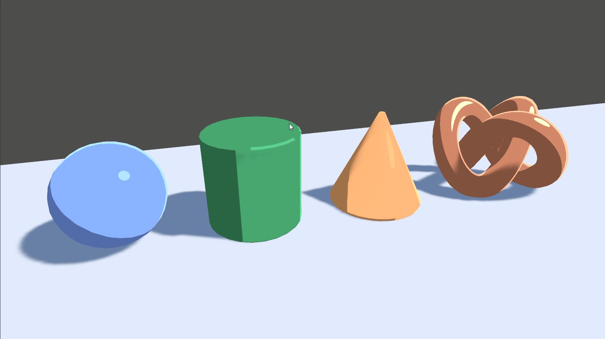

## 效果图



## 思路
复刻于：https://roystan.net/articles/toon-shader.html

总体思路 ：我们将编写一个shader，它接收来自**单一方向的光源**，并具有**镜面反射**和**边缘光**，接下来我们来一步一步实现。

## 开始工作
首先定义我们所需要使用的[[001-从Built-in到URP#属性|属性]]。
```glsl
SubShader
{
	Properties
	{
		// 基础颜色与贴图
		_BaseColor("Base Color", Color) = (0.5, 0.65, 1, 1)
		_MainTex("Main Texture", 2D) = "white" {}	
		
		// 环境光颜色，环境光均匀地施加到对象的所有表面上
		[HDR]_AmbientColor("Ambient Color", Color) = (0.4,0.4,0.4,1)
		
		// 高光颜色
		[HDR]_SpecularColor("Specular Color", Color) = (0.9,0.9,0.9,1)
		// 控制镜面反射的大小
		_Glossiness("Glossiness", Float) = 32
		
		// 边缘光颜色
		[HDR]_RimColor("Rim Color", Color) = (1,1,1,1)
		// 边缘光强度
		_RimAmount("Rim Amount", Range(0, 1)) = 0.716
		// 控制边缘在接近表面的未照明部分时的融合程度。
		_RimThreshold("Rim Threshold", Range(0, 1)) = 0.1
	}
	...
}
```

我们使用的URP渲染管线，且着色器只与一个单向光源相互作用，所以我们需要设置以下[[001-从Built-in到URP#Tags|Tags]]。
```glsl
SubShader
{
	// SubShader 中的Tags，适用于它包含的所有Pass
	Tags 
	{ 
		"RenderPipeline"="UniversalPipeline"
	}
	
	...
	
	Pass
	{
		// 	Pass中的Tags只适用于当前Pass
		Tags
		{
			"LightMode" = "UniversalForward"
			"PassFlags" = "OnlyDirectional"//只接收直线光
		}
	}
}
```

接下来需要引用HLSL的函数库，这里需要引用Core和Lighting库，需要用HLSLINCLUDE和ENDHLSL包含，同时在其中定义所有[[001-从Built-in到URP#属性|属性]]和[[001-从Built-in到URP#结构体|结构体]]。

注意，我们可以使用**UnityPerMaterial CBUFFER**来确保着色器兼容SRP批处理。这个**CBUFFER**需要包括所有公开的属性(与Shaderlab属性块中的相同)。但它不能包括其他未公开的变量，纹理也不需要被包括。
```glsl
HLSLINCLUDE
#include "Packages/com.unity.render-pipelines.universal/ShaderLibrary/Core.hlsl"
#include "Packages/com.unity.render-pipelines.universal/ShaderLibrary/Lighting.hlsl"

// UnityPerMaterial CBUFFER来确保着色器兼容SRP批处理
// 这个CBUFFER需要包括所有公开的属性(与Shaderlab属性块中的相同)。
// 但它不能包括其他未公开的变量，纹理也不需要被包括。
CBUFFER_START(UnityPerMaterial)
float4 _MainTex_ST;// 如果要进行纹理采样，必须声明对应的_ST。
float4 _BaseColor;
float4 _AmbientColor;
float4 _SpecularColor;
float _Glossiness;
float4 _RimColor;
float _RimAmount;
float _RimThreshold;
CBUFFER_END

TEXTURE2D(_MainTex);// 定义纹理
SAMPLER(sampler_MainTex);// 纹理采样器

// 结构体 顶点着色器使用数据
struct a2v
{
	float4 positionOS : POSITION;
	float2 texcoord : TEXCOORD;
	float3 normalOS : NORMAL;
};

// 片元着色器使用数据
struct v2f
{
	float4 positionCS : SV_POSITION;
	float2 texcoord : TEXCOORD0;
	float3 normalWS : NORMAL;
	float3 positionWS : TEXCOORD1;
};
ENDHLSL
```

基础数据已经准备完毕，接下来需要在Pass里面进行计算。我们首先声明顶点着色函数与片元着色函数，需要包含在HLSLPROGRAM 和 ENDHLSL 之中。
```glsl
HLSLPROGRAM
#pragma vertex vert
#pragma fragment frag

// 顶点着色器
v2f vert (a2v i)
{
	v2f o;

	return o;
}

// 片元着色器
half4 frag (v2f i) : SV_Target
{

}

ENDHLSL
```

编写顶点着色器，为下一阶段提供数据。
```glsl
v2f vert (a2v i)
{
	v2f o;

	// 获取顶点在齐次裁剪空间的坐标
	o.positionCS = TransformObjectToHClip(i.positionOS.xyz);
	// 获取计算完tiling和offest后的纹理坐标
	o.texcoord = TRANSFORM_TEX(i.texcoord,_MainTex);
	// 获取世界空间的法线
	o.normalWS = TransformObjectToWorldNormal(i.normalOS.xyz);
	// 获取世界空间坐标
	o.positionWS = TransformObjectToWorld(i.positionOS.xyz);
	return o;
}
```
>为什么要在顶点着色器中进行tiling和offest的计算呢？
>我认为在顶点着色器中，计算tiling和offest后保存下纹理信息，比在更复杂的片元着色器中使用的时候再进行计算是更加划算的。

编写片元着色器。
```glsl
half4 frag (v2f i) : SV_Target
{
	float4 mainTex = SAMPLE_TEXTURE2D(_MainTex,sampler_MainTex,i.texcoord);

	Light mainLight = GetMainLight(TransformWorldToShadowCoord(i.positionWS));
	float3 WS_L = normalize(mainLight.direction);//光照方向
	float3 WS_N = normalize(i.normalWS);//法线
	float3 WS_V =  normalize(_WorldSpaceCameraPos-i.positionWS);//观察方向
	float3 WS_H = normalize(WS_V+WS_L);//半程向量

	//漫反射
	float NdotL = dot(WS_L,WS_N);
	float lightIntensity = smoothstep(0,0.01,NdotL);
	float4 light = lightIntensity*float4(mainLight.color,1)*mainLight.shadowAttenuation;

	//镜面 高光
	float NdotH = dot(WS_N,WS_H);
	float specularIntensity = pow(NdotH * lightIntensity ,_Glossiness * _Glossiness);
	float specularIntensitySmooth = smoothstep(0.005,0.01,specularIntensity);//005
	float4 specular = specularIntensitySmooth * _SpecularColor * mainLight.shadowAttenuation;

	//外描边
	float rimDot = 1 - dot(WS_V,WS_N);				
	//我们只希望边缘出现在表面的光亮面，
	//因此，将其乘以NdotL，并提升为平滑融合的能力。 
	float rimIntensity = rimDot * pow(NdotL,_RimThreshold);
	rimIntensity = smoothstep(_RimAmount - 0.01,_RimAmount + 0.01,rimIntensity);
	float4 rim = rimIntensity * _RimColor;

	return mainTex * _BaseColor * (light+_AmbientColor + rim + specular);
}
```

目前为止我们是没有添加阴影的，这里我们直接使用URP Lit的ShadowCaster。需要添加以下代码。
```glsl
HLSLPROGRAM
#pragma vertex vert
#pragma fragment frag	

// 添加以下代码
// 关键字编译多个变体shader 计算阴影所需要
#pragma multi_compile _ _MAIN_LIGHT_SHADOWS
#pragma multi_compile _ _MAIN_LIGHT_SHADOWS_CASCADE
#pragma multi_compile _ _SHADOWS_SOFT//柔化阴影，得到软阴影

...
ENDHLSL

// 最后在Pass完成后添加UsePass 使用Lit的ShadowCaster Pass
// 阴影
UsePass "Universal Render Pipeline/Lit/ShadowCaster"
```

## 完整代码
```glsl
Shader "MyURP/Toon"
{
	Properties
	{
		// 基础颜色与贴图
		_BaseColor("Base Color", Color) = (0.5, 0.65, 1, 1)
		_MainTex("Main Texture", 2D) = "white" {}	
		
		// 环境光颜色，环境光均匀地施加到对象的所有表面上
		[HDR]_AmbientColor("Ambient Color", Color) = (0.4,0.4,0.4,1)
		
		// 高光颜色
		[HDR]_SpecularColor("Specular Color", Color) = (0.9,0.9,0.9,1)
		// 控制镜面反射的大小
		_Glossiness("Glossiness", Float) = 32
		
		// 边缘光颜色
		[HDR]_RimColor("Rim Color", Color) = (1,1,1,1)
		// 边缘光强度
		_RimAmount("Rim Amount", Range(0, 1)) = 0.716
		// 控制边缘在接近表面的未照明部分时的融合程度。
		_RimThreshold("Rim Threshold", Range(0, 1)) = 0.1
	}
	SubShader
	{
		Tags 
		{ 
			"RenderPipeline"="UniversalPipeline"
		}

		HLSLINCLUDE
		#include "Packages/com.unity.render-pipelines.universal/ShaderLibrary/Core.hlsl"
		#include "Packages/com.unity.render-pipelines.universal/ShaderLibrary/Lighting.hlsl"

		// UnityPerMaterial CBUFFER来确保着色器兼容SRP批处理
		// 这个CBUFFER需要包括所有公开的属性(与Shaderlab属性块中的相同)。
		// 但它不能包括其他未公开的变量，纹理也不需要被包括。
		CBUFFER_START(UnityPerMaterial)
		float4 _MainTex_ST;// 如果要进行纹理采样，必须声明对应的_ST。
		float4 _BaseColor;
		float4 _AmbientColor;
		float4 _SpecularColor;
		float _Glossiness;
		float4 _RimColor;
		float _RimAmount;
		float _RimThreshold;
		CBUFFER_END
		
		// 定义纹理
		TEXTURE2D(_MainTex);
		// 定义纹理采样器
		SAMPLER(sampler_MainTex);
        
		struct a2v
		{
			float4 positionOS : POSITION;
			float2 texcoord : TEXCOORD;
			float3 normalOS : NORMAL;
		};
            
		struct v2f
		{
			float4 positionCS : SV_POSITION;
			float2 texcoord : TEXCOORD0;
			float3 normalWS : NORMAL;
			float3 positionWS : TEXCOORD1;
		};
		ENDHLSL
            
		Pass
		{
			Tags
			{
				"LightMode" = "UniversalForward"
				"PassFlags" = "OnlyDirectional"//只接收直线光
			}

			HLSLPROGRAM
			#pragma vertex vert
			#pragma fragment frag	
			//关键字编译多个变体shader 计算阴影所需要
			#pragma multi_compile _ _MAIN_LIGHT_SHADOWS
			#pragma multi_compile _ _MAIN_LIGHT_SHADOWS_CASCADE
			#pragma multi_compile _ _SHADOWS_SOFT//柔化阴影，得到软阴影
                
			v2f vert (a2v i)
			{
				v2f o;

				o.positionCS = TransformObjectToHClip(i.positionOS.xyz);
				o.texcoord = TRANSFORM_TEX(i.texcoord,_MainTex);
				o.normalWS = TransformObjectToWorldNormal(i.normalOS.xyz);
				o.positionWS = TransformObjectToWorld(i.positionOS.xyz);
				return o;
			}
           
			half4 frag (v2f i) : SV_Target
			{
				float4 mainTex = SAMPLE_TEXTURE2D(_MainTex,sampler_MainTex,i.texcoord);

				Light mainLight = GetMainLight(TransformWorldToShadowCoord(i.positionWS));
				float3 WS_L = normalize(mainLight.direction);//光照方向
				float3 WS_N = normalize(i.normalWS);//法线
				float3 WS_V =  normalize(_WorldSpaceCameraPos-i.positionWS);//观察方向
				float3 WS_H = normalize(WS_V+WS_L);//半程向量

				//漫反射
				float NdotL = dot(WS_L,WS_N);
				float lightIntensity = smoothstep(0,0.01,NdotL);
				float4 light = lightIntensity*float4(mainLight.color,1)*mainLight.shadowAttenuation;

				//镜面 高光
 				float NdotH = dot(WS_N,WS_H);
				float specularIntensity = pow(NdotH * lightIntensity ,_Glossiness * _Glossiness);
				float specularIntensitySmooth = smoothstep(0.005,0.01,specularIntensity);//005
				float4 specular = specularIntensitySmooth * _SpecularColor * mainLight.shadowAttenuation;

				//外描边
				float rimDot = 1 - dot(WS_V,WS_N);				
				//我们只希望边缘出现在表面的光亮面，
				//因此，将其乘以NdotL，并提升为平滑融合的能力。 
				float rimIntensity = rimDot * pow(NdotL,_RimThreshold);
				rimIntensity = smoothstep(_RimAmount - 0.01,_RimAmount + 0.01,rimIntensity);
				float4 rim = rimIntensity * _RimColor;

				return mainTex * _BaseColor * (light+_AmbientColor + rim + specular);
			}
			ENDHLSL
		}
		//阴影
		UsePass "Universal Render Pipeline/Lit/ShadowCaster"
	}
}
```

