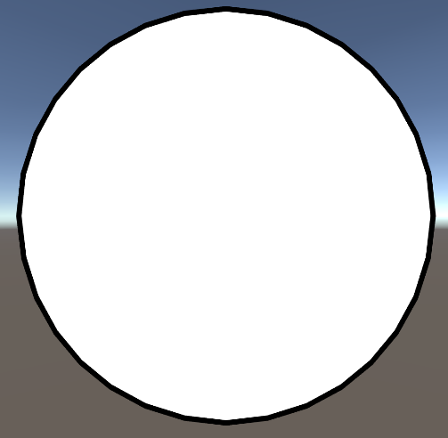

# 从零开始的卡通渲染-描边篇
## 序言
卡通渲染属于非真实渲染（Non-photorealistic rendering，简称NPR）。对应的还有真实感渲染(Photorealistic rendering)。后者旨在渲染真实感的画面，而前者则追求更加有艺术感的画面效果，例如手绘风格的画面。
NPR也有各种各样的类型。比如像油画，铅笔画，水墨画风格的画面。这里主要探讨像日本动画那样的卡通渲染风格，目前一般称之为Cel Shading。
回到正题。描边是卡通渲染的一个非常重要的主题，目前比较流行的描边方法有两种，一个绘制两次，一次角色，一次描边。一种是后处理。基于后处理的描边相对不容易定制，比较适用于对复杂场景进行描边。这里讲述通过2次绘制来绘制描边的方法。在《罪恶装备》中称其为Back Facing法。
## Back Facing描边法
基本思路是绘制两次，一次角色，一次描边。绘制描边的时候，在顶点着色器将顶点沿着法线方向位移一段距离，使得模型轮廓放大，渲染作为描边。同时绘制描边时使用Cull Front。这样描边和角色重叠的部分会因为不能通过深度检测而被Cull掉，保证描边不会遮挡角色。两次绘制颠倒顺序也是可以的，不过后绘制描边，可以通过深度检测过滤掉很多描边绘制的像素，效率会更好。这里先实现最简单的方法，然后逐步进行优化。
```glsl
Shader "2173NRP/Ouline"
{
    Properties
    {
		_OutlineWidth ("Outline Width", Range(0.01, 1)) = 0.24
        _OutLineColor ("OutLine Color", Color) = (0.5,0.5,0.5,1)
    }
    SubShader
    {
        Tags 
        { 
            "RenderPipeline"="UniversalRenderPipeline"
            "RenderType"="Opaque" 
        }
		
		HLSLINCLUDE
		#include "Packages/com.unity.render-pipelines.universal/ShaderLibrary/Core.hlsl"
		
		CBUFFER_START(UnityPerMaterial)
		float _OutlineWidth;
		float4 _OutLineColor;
		CBUFFER_END
		
		struct a2v
		{
			float4 positionOS : POSITION;
			float3 normal : NORMAL;
			float4 vertColor : COLOR;
			float4 tangent : TANGENT;
		};

		struct v2f
		{
			float4 positionCS : SV_POSITION;
			float3 vertColor : COLOR;
		};

		ENDHLSL
		
		Pass
		{
			NAME"MainPass"
			Tags
			{
				"LightMode"="UniversalForward"
			}
			
			Cull Back
					
			HLSLPROGRAM
			#pragma vertex vert
            #pragma fragment frag

			v2f vert(a2v i)
			{
				v2f o;
				o.positionCS = TransformObjectToHClip(i.positionOS.xyz);
				return o;
			};
			
			half4 frag(v2f i): SV_TARGET 
			{
				return half4(1,1,1,1);
			};		
			ENDHLSL
		}

		
		Pass
		{
			NAME"OutlinePass"
			
			Cull Front
				
			HLSLPROGRAM
			#pragma vertex vert
            #pragma fragment frag
			
			v2f vert(a2v i)
			{
				v2f o;
				o.positionCS = TransformObjectToHClip(float3(i.positionOS.xyz + i.normal * _OutlineWidth * 0.1));//顶点沿着法线方向外扩,世界空间小，宽度会随摄像机变化
				return o;
			};
			
			half4 frag(v2f i) : SV_TARGET
			{
				return _OutLineColor;
			};
			
			ENDHLSL
		}
		
    }
}
```
现在我们用Unity预设的球体进行渲染

看起来描边效果正常。


## 修正摄像机距离问题
现在我们将摄像机拉近，发现摄像机拉近后，描边变得很粗。


这是因为描边的宽度现在是相对世界空间不变的，这相机拉近后，显示就会变粗。我们期望无论摄像机拉近拉远，描边的粗细都能不变。要解决这个问题，可以通过将法线外扩的大小调整为使用NDC空间的距离进行外扩。这里参考[这篇文章](https://zhuanlan.zhihu.com/p/95986273)对代码进行一些修改。
```glsl
v2f o;
// 将法线外扩的大小调整为使用NDC空间的距离进行外扩
float4 pos = TransformObjectToHClip(i.positionOS.xyz);
float3 viewNormal = mul((float3x3)UNITY_MATRIX_IT_MV, i.tangent.xyz);//观察空间法线,使用切线数据作为外扩数据
float3 ndcNormal = normalize(TransformWViewToHClip(viewNormal.xyz)) * pos.w;//将法线变换到裁剪空间
pos.xy += 0.01 * _OutlineWidth * ndcNormal.xy;
o.pos = pos;
return o;
```

描边的两边比较粗，上下比较细，宽度不统一。
shader_1

结果似乎有些问题，描边的两边粗，上下细。这是因为NDC空间的xy是范围是\[0,1\]。但是我这里的窗口分辨率是16：9，所以直接用NDC空间的距离外扩，不能适配宽屏窗口。所以需要根据窗口的宽高比再进行修正。这里再对描边进行修改
```glsl
v2f o;
// 将法线外扩的大小调整为使用NDC空间的距离进行外扩
float4 pos = TransformObjectToHClip(i.positionOS.xyz);
float3 viewNormal = mul((float3x3)UNITY_MATRIX_IT_MV, i.tangent.xyz);//观察空间法线,使用切线数据作为外扩数据
float3 ndcNormal = normalize(TransformWViewToHClip(viewNormal.xyz)) * pos.w;//将法线变换到裁剪空间

float4 nearUpperRight = mul(unity_CameraInvProjection, float4(1, 1, UNITY_NEAR_CLIP_VALUE, _ProjectionParams.y));
// 求得屏幕宽高比
float aspect = abs(nearUpperRight.y / nearUpperRight.x);

ndcNormal.x *= aspect;

pos.xy += 0.01 * _OutlineWidth * ndcNormal.xy;
o.pos = pos;
return o;
```
描边宽度正常了。


摄像机拉远以后，显示的描边宽度也保持不变


## 修正不光滑物体断边问题
之前我们渲染了unity的预制球体，现在我们换成预制的立方体试一下。

描边的四角都断开了。


嗯…四个角的描边都断开了。这方案不行，Pass，放弃，（摔）。改用后处理描边吧。

咳…因为这个模型每个面的顶点的法线都垂直于这个平面。所以描边的外扩也是垂直于平面，当模型有转角的情况下，描边就会像这样裂开。Back facing的描边方法会有这样的问题。困扰了我一段时间，后来看到一个叫Toony Colors Pro的Unity插件，有了比较好的解决方法。

要解决这个问题，需要对模型外扩使用的法线数据进行修改。这里需要将在相同位置顶点的法线数据，进行平均计算，将算出来的新法线写入模型切线数据中。然后使用这个切线数据进行法线外扩。至于为什么要写到切线数据里，这是因为只有法线和切线数据会随着骨骼动画而改变。所以如果渲染的是有骨骼动画的角色，写入切线数据里就不用做额外处理，计算上简单一些。如果碰到了角色使用法线贴图或者各项异性材质这种需要原始切线数据的情况，那么可以先把平均法线转换到切线空间，再保存到UV或者顶点颜色上。计算的时候，从切线空间把平均法线数据还原到世界空间，计算上会稍微麻烦一点。不过因为切线空间也是随骨骼动画改变的，所以这个方法的结果也是正确的。这里我写了一个编辑器工具，完成对mesh数据的添加。

```C#
public class PlugTangentTools
{
    [MenuItem("Tools/模型平均法线写入切线数据")]
    public static void WirteAverageNormalToTangentToos()
    {
        MeshFilter[] meshFilters = Selection.activeGameObject.GetComponentsInChildren<MeshFilter>();
        foreach (var meshFilter in meshFilters)
        {
            Mesh mesh = meshFilter.sharedMesh;
            WirteAverageNormalToTangent(mesh);
        }

        SkinnedMeshRenderer[] skinMeshRenders = Selection.activeGameObject.GetComponentsInChildren<SkinnedMeshRenderer>();
        foreach (var skinMeshRender in skinMeshRenders)
        {
            Mesh mesh = skinMeshRender.sharedMesh;
            WirteAverageNormalToTangent(mesh);
        }
    }

    private static void WirteAverageNormalToTangent(Mesh mesh)
    {
        var averageNormalHash = new Dictionary<Vector3, Vector3>();
        for (var j = 0; j < mesh.vertexCount; j++)
        {
            if (!averageNormalHash.ContainsKey(mesh.vertices[j]))
            {
                averageNormalHash.Add(mesh.vertices[j], mesh.normals[j]);
            }
            else
            {
                averageNormalHash[mesh.vertices[j]] =
                    (averageNormalHash[mesh.vertices[j]] + mesh.normals[j]).normalized;
            }
        }

        var averageNormals = new Vector3[mesh.vertexCount];
        for (var j = 0; j < mesh.vertexCount; j++)
        {
            averageNormals[j] = averageNormalHash[mesh.vertices[j]];
        }

        var tangents = new Vector4[mesh.vertexCount];
        for (var j = 0; j < mesh.vertexCount; j++)
        {
            tangents[j] = new Vector4(averageNormals[j].x, averageNormals[j].y, averageNormals[j].z, 0);
        }
        mesh.tangents = tangents;
    }
}
```

同时描边的方法里，改为使用切线数据作为外扩数据。

```text
float3 viewNormal = mul((float3x3)UNITY_MATRIX_IT_MV, i.tangent.xyz);
```


立方体的描边也显示正确了

现在这个立方体的模型也可以正确的描边了。不过这个方法只是临时修改了mesh数据，关闭Unity就丢失了。如果要将计算出的切线数据保存下来的话。一个可行的方案是使用FBX的SDK来编写工具，将计算出的切线数据写入模型里。我们试着用两种方式对角色进行描边来对比表现。

使用原始法线数据。


使用平均法线数据。


对比可以看到，使用新的法线数据进行描边，模型描边断边的问题少了很多。

## 总结
在本节实现了一个不管摄像机距离，可以保持宽度不变的Back Facing描边方法。优化了Back Facing描边在不光滑物体出现的破边问题。实现了通过顶点色数据对描边进行调整的方法。接下来，将会讨论一些用于卡通渲染的光照计算的实现方法。
## 引用
- 原文:https://zhuanlan.zhihu.com/p/109101851