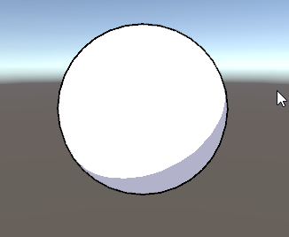
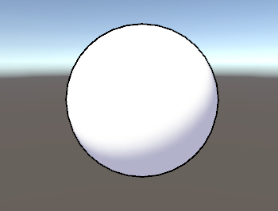

 
# 从零开始的卡通渲染-着色篇
## 序言
**如何让角色看起来卡通**

1.减少色阶数量

2.冷暖色调分离

3.对明暗区域的手绘控制

## 双色阶的渲染实现
首先我们实现一个明暗边界分明的光照效果，并支持分别设置明暗区域的颜色，设置暗面颜色为冷色调，和明面的色调做出区分。
```glsl
Shader "2173NRP/2173NRPCelRender"
{
	Properties
	{
		_MainTex("MainTex", 2D) = "white" {}
		_MainColor("Main Color", Color) = (1,1,1)
		_ShadowColor("Shadow Color", Color) = (0.7, 0.7, 0.8)
		_ShadowRange("Shadow Range", Range(0, 1)) = 0.5
		_ShadowSmooth("Shadow Smooth", Range(0, 1)) = 0.2

		[Space(10)]
		_OutlineWidth("Outline Width", Range(0.01, 10)) = 0.24
		_OutLineColor("OutLine Color", Color) = (0.5,0.5,0.5,1)
	}
	SubShader
	{
		Tags
		{
			"RenderPipeline" = "UniversalRenderPipeline"
			"RenderType" = "Opaque"
		}

		HLSLINCLUDE
		#include "Packages/com.unity.render-pipelines.universal/ShaderLibrary/Core.hlsl"
		#include "Packages/com.unity.render-pipelines.universal/ShaderLibrary/Lighting.hlsl"

		CBUFFER_START(UnityPerMaterial)
		float4 _MainTex_ST;
		float4 _MainColor;
		float4 _ShadowColor;
		float _ShadowRange;
		float _ShadowSmooth;
		float _OutlineWidth;
		float4 _OutLineColor;
		CBUFFER_END

		TEXTURE2D(_MainTex);
		SAMPLER(sampler_MainTex);

		ENDHLSL

		Pass
		{
			NAME"MainPass"
			Tags
			{
				"LightMode" = "UniversalForward"
			}

			Cull Back

			HLSLPROGRAM
			#pragma vertex vert
			#pragma fragment frag

			struct a2v
			{
				float4 positionOS : POSITION;
				float2 texcoord : TEXCOORD0;
				float3 normal : NORMAL;
			};

			struct v2f
			{
				float4 positionCS : SV_POSITION;
				float2 texcoord : TEXCOORD0;
				float3 normalWS : TEXCOORD1;
				float3 viewDirWS : TEXCOORD2;
			};

			v2f vert(a2v i)
			{
				v2f o;
				o.positionCS = TransformObjectToHClip(i.positionOS.xyz);
				o.normalWS = TransformObjectToWorldNormal(i.normal);
				o.texcoord = TRANSFORM_TEX(i.texcoord, _MainTex);
				o.viewDirWS = normalize(_WorldSpaceCameraPos.xyz - TransformObjectToWorld(i.positionOS.xyz));
				return o;
			};

			half4 frag(v2f i) : SV_TARGET
			{
				half4 col = 1;
				half4 mainTex = SAMPLE_TEXTURE2D(_MainTex, sampler_MainTex, i.texcoord);
				half3 viewDir = normalize(i.viewDirWS);
				half3 worldNormal = normalize(i.normalWS);
				
				Light myLight = GetMainLight();
				half3 worldLightDir = normalize(myLight.direction);

				half halfLambert = dot(worldNormal, worldLightDir) * 0.5 + 0.5;//半兰伯特

                half3 diffuse = halfLambert > _ShadowRange ? _MainColor : _ShadowColor;
                diffuse *= mainTex;
                col.rgb = _LightColor0 * diffuse;

				return col;
			};
			ENDHLSL
		}

		Pass
		{
			//...参考上一篇
		}
	}
}
```

实现明暗边界分明的光照，并且单独设置明面和暗面的颜色来区分色调。


## smoothstep柔化明暗边界
现在我们希望能够对明暗边界的变化做一些柔化，让风格往厚涂的风格靠一些，这样可以跟更容易地跟一些非赛璐璐风格的场景做融合。这里我们使用**smoothstep**函数实现这个效果。这个函数可以在根据输入数据，计算一个范围在0到1区间的平滑过渡曲线。通过这个函数的结果对明面和暗面的颜色进行插值，来实现明暗边界的软硬控制。
对代码进行如下修改。
```glsl
half halfLambert = dot(worldNormal, worldLightDir) * 0.5 + 0.5;
half ramp = smoothstep(0, _ShadowSmooth, halfLambert - _ShadowRange);
half3 diffuse = lerp(_ShadowColor, _MainColor, ramp);

```

使用smoothstep函数对明暗分界的软硬进行控制。


也可以使用Ramp贴图来实现色阶变化，这里就提一下可以生成Ramp图的插件Toony Colors Pro。

## ilmTexture贴图的实现（改数值控制）
原文使用使用称为ilmTexture的贴图对角色明暗区域实现手绘风格的控制。其中绿通道控制漫反射的阴影阈值，红通道控制高光强度，蓝通道控制高光范围。但在这里因为我就先用数值控制了，需要贴图控制的可以去看看原文，我就直接贴完整代码了。
```glsl
Shader "2173NRP/2173NRPCelRenderFull"
{
    Properties
    {
		_MainTex ("MainTex", 2D) = "white" {}
        _IlmTex ("IlmTex", 2D) = "white" {}

		[Space(20)]
		_MainColor("Main Color", Color) = (1,1,1)
		_ShadowColor ("Shadow Color", Color) = (0.7, 0.7, 0.7)
		_ShadowSmooth("Shadow Smooth", Range(0, 0.03)) = 0.002
		_ShadowRange ("Shadow Range", Range(0, 1)) = 0.6

		[Space(20)]
		_SpecularColor("Specular Color", Color) = (1,1,1)
		_SpecularRange ("Specular Range",  Range(0, 1)) = 0.9
        _SpecularMulti ("Specular Multi", Range(0, 1)) = 0.4
		_SpecularGloss("Sprecular Gloss", Range(0.001, 8)) = 4

		[Space]
		_ShadowThreshold("Shadow Threshold", float) = 0.1
		_SpecularIntensity("Specular Intensity", float) = 0.1
		_SpecularRangeMask("Specular Range Mask", float) = 0.1

		[Space(20)]
		_OutlineWidth ("Outline Width", Range(0, 1)) = 0.24
        _OutLineColor ("OutLine Color", Color) = (0.5,0.5,0.5,1)
    }
    SubShader
    {
		Tags
		{
			"RenderPipeline" = "UniversalRenderPipeline"
			"RenderType" = "Opaque"
		}

        HLSLINCLUDE
		#include "Packages/com.unity.render-pipelines.universal/ShaderLibrary/Core.hlsl"
		#include "Packages/com.unity.render-pipelines.universal/ShaderLibrary/Lighting.hlsl"

		CBUFFER_START(UnityPerMaterial)
		float4 _MainTex_ST;
		float4 _IlmTex_ST;
		float4 _MainColor;
		float4 _ShadowColor;
		half _ShadowRange;
		half _ShadowSmooth;

        float4 _SpecularColor;
        float _SpecularRange;
        float _SpecularMulti;
        float _SpecularGloss;

		float _ShadowThreshold;
		float _SpecularIntensity;
		float _SpecularRangeMask;
	

		float _OutlineWidth;
		float4 _OutLineColor;
		CBUFFER_END

        TEXTURE2D(_MainTex);
		SAMPLER(sampler_MainTex);		
        TEXTURE2D(_IlmTex);
		SAMPLER(sampler_IlmTex);

        ENDHLSL

        Pass
        {
			NAME"MainPass"
			Tags
			{
				"LightMode" = "UniversalForward"
			}

			Cull Back

			HLSLPROGRAM
			#pragma vertex vert
			#pragma fragment frag

            struct a2v
			{
				float4 vertex : POSITION;
				float2 uv : TEXCOORD0;
				float3 normal : NORMAL;
			};

			struct v2f
			{
				float4 pos : SV_POSITION;
				float2 uv : TEXCOORD0;	
				float3 worldNormal : TEXCOORD1;
				float3 worldPos : TEXCOORD2; 
			};

            v2f vert (a2v v)
            {
				v2f o = (v2f)0;
				o.pos = TransformObjectToHClip(v.vertex.xyz);
				o.uv = TRANSFORM_TEX(v.uv, _MainTex);
				o.worldNormal = TransformObjectToWorldNormal(v.normal);
				o.worldPos = mul(unity_ObjectToWorld, v.vertex).xyz;
				return o;
            }

            half4 frag (v2f i) : SV_Target
            {
				half4 col = 0;
				half4 mainTex = SAMPLE_TEXTURE2D(_MainTex,sampler_MainTex, i.uv);
				//half4 ilmTex = SAMPLE_TEXTURE2D (_IlmTex,sampler_IlmTex, i.uv);
				half3 viewDir = normalize(_WorldSpaceCameraPos.xyz - i.worldPos.xyz);
				half3 worldNormal = normalize(i.worldNormal);

				Light myLight = GetMainLight();
				half3 worldLightDir = normalize(myLight.direction.xyz);

				half3 diffuse = 0;
				half halfLambert = dot(worldNormal, worldLightDir) * 0.5 + 0.5;
				//half threshold = (halfLambert + ilmTex.g) * 0.5;
				half threshold = (halfLambert + _ShadowThreshold) * 0.5;
				half ramp = saturate(_ShadowRange  - threshold); 
				ramp =  smoothstep(0, _ShadowSmooth, ramp);
				diffuse = lerp(_MainColor, _ShadowColor, ramp);
				diffuse *= mainTex.rgb;

				half3 specular = 0;
				half3 halfDir = normalize(worldLightDir + viewDir);
				half NdotH = max(0, dot(worldNormal, halfDir));
				half SpecularSize = pow(NdotH, _SpecularGloss);
				//half specularMask = ilmTex.b;
				half specularMask = _SpecularRangeMask;
				if (SpecularSize >= 1 - specularMask * _SpecularRange)
				{
					//specular = _SpecularMulti * (ilmTex.r) * _SpecularColor;
					specular = _SpecularMulti * _SpecularIntensity * _SpecularColor;
				}


				col.rgb = (diffuse + specular) * myLight.color.rgb;
				return col;
            }
            ENDHLSL
        }

		Pass
		{
			//...参考之前的外描边
		}
    }
}
```

## 引用
- 原文: https://zhuanlan.zhihu.com/p/110025903