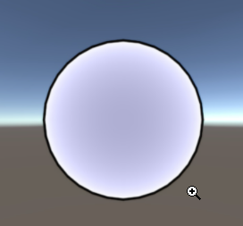
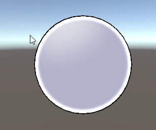

# 从零开始的卡通渲染-着色篇（2）
## 序言
在上一篇中，介绍了一些卡通渲染的光照计算方法。在本节中，我们将讨论有关卡通渲染的边缘光和Bloom后处理效果。

**边缘光和后处理在卡通渲染中的作用**
边缘光是卡通渲染中重要的组成部分。它和描边一样都在物体的轮廓出现。卡通渲染通常饱和度比较高，描边和边缘光能够让角色从高饱和度的画面中凸显出来。在动画中也经常用边缘光经常用来表现逆光效果。

## 边缘光的实现
基于上一篇的代码进行修改。
```glsl
//  把属性加进入
_RimColor ("Rim Color", Color) = (1,1,1)
_RimMin ("Rim Min", Range(0, 1)) = 0
_RimMax ("Rim Max", Range(0, 1)) = 0
_RimSmooth ("Rim Smooth", Range(0, 1)) = 0
// 包括UnityPerMaterial里面

...
half f =  1.0 - saturate(dot(viewDir, worldNormal));
half3 rimColor = f * _RimColor.rgb *  _RimColor.a;
col.rgb = (diffuse + specular + rimColor) * _LightColor0.rgb;
```



在卡通渲染中，边缘光的过度通常会比较硬，所以需要对边缘光的软硬和范围进行控制。这里我们和上一章一样采用**smoothstep**函数来帮助我们解决问题。对代码进行如下修改。
```glsl
half f =  1.0 - saturate(dot(viewDir, worldNormal));
half rim = smoothstep(_RimMin, _RimMax, f);
rim = smoothstep(0, _RimSmooth, rim);
half3 rimColor = rim * _RimColor.rgb *  _RimColor.a;
```
使用smoothstep函数调整边缘光的范围和软硬。


## 引用
- 原文:https://zhuanlan.zhihu.com/p/111633226