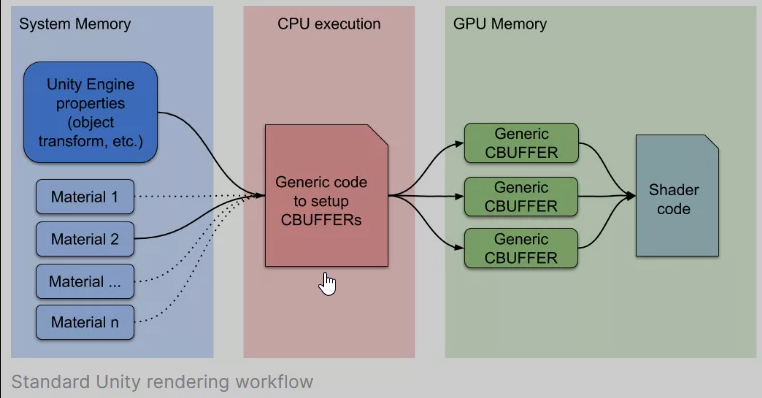
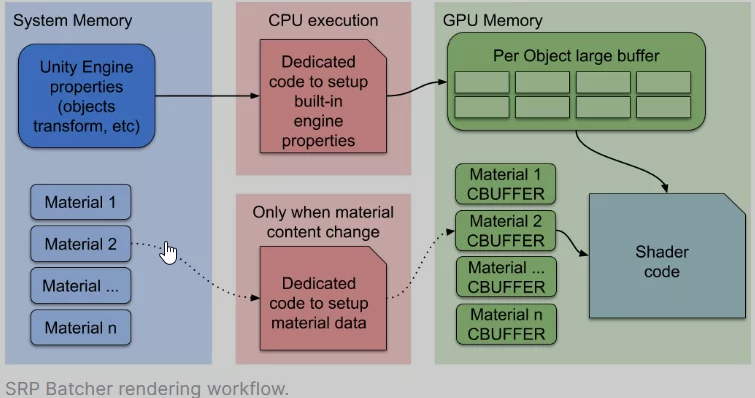

# SRP Batcher
## Unity和Materials

Unity是一个非常灵活的渲染引擎，你可以在一帧的的任何时间点修改任何Material属性。此外，Unity历史版本的渲染管线并不是面向Constant Buffer进行开发的，这是为了支持DX9这样的图形API。但是，这样漂亮的功能有一些弊端，比如当一个DrawCall要求使用一个新的Material的时候，需要有大量的工作去处理，所以，你在一个场景中的Material越多，为了设置GPU端的数据而占用的CPU资源就越多。解决此问题的传统方法是减少DrawCall的数量以优化CPU渲染消耗，因为Unity在发出DrawCall之前必须进行很多设置。而且实际的CPU消耗就来自该设置，而不是来自GPU DrawCall本身，而这只是Unity需要将其推送到GPU命令缓冲区的一些字节而已。

在渲染的循环中，当一个新的Material被发现了，CPU会收集所有的属性并且在GPU的内存中设置不同的Constant Buffers。GPU缓冲区的数量就取决于Shader是如何声明其CBUFFERs的。

## SPR是如何工作的

当我们开发SRP的时候，我们不得不重写一些引擎的底层部分。这同样是一个好机会，我们可以原生地集成一些新的规范，例如GPU数据持久化。我们旨在加快场景使用大量不同材质（但Shader变体很少）的这种常见情况。

现在，**底层的渲染Loop可以把material的数据持久化在GPU的内存。如果material的内容没有改变，我们就不需要设置，上传buffer到GPU**。此外，我们使用特定的代码路径来在一个大的GPU buffer中快速的更新引擎的内置属性。现在这个新的流程图就像这样：

这样，CPU就只需要处理引擎内置的属性（例如标记为对象的变换的属性）。所有的Materials都在GPU内存上有一块持久化的CBUFFERs。综上所述，SRP Batcher加速来自于两个不同的方面：

-   每个材质的内容持久化在GPU的memory上
-   一个专用的代码路径来管理一个大的“per object”的GPU CBUFFER