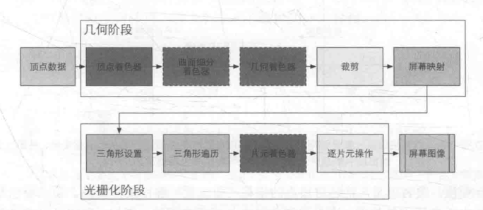
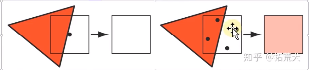
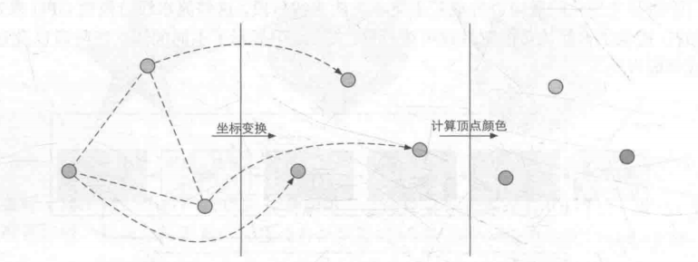
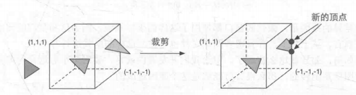
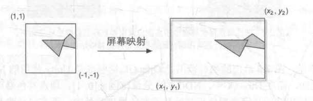
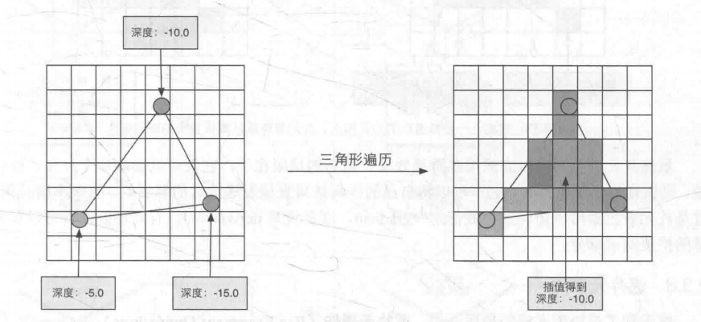
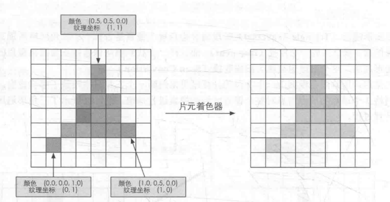
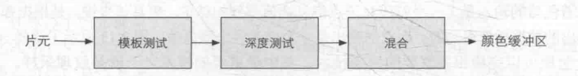

# 渲染流水线

## 整体流程

1. **应用阶段**：粗粒度剔除，进行渲染设置，准备基本数据，输出到几何阶段
2. **几何阶段**：顶点着色器，曲面细分，几何着色器，顶点裁剪，屏幕映射
3. **光栅化阶段**：三角形（点/线）设置，三角形（点/线）遍历，片段着色器
4. **逐片元操作**：裁剪测试，透明度测试，深度测试，模板测试，混合
5. **后处理**

>顶点数据→ 顶点着色器（几何阶段）→ 曲面细分着色器（几何阶段）→ 投影（几何阶段）→ 几何着色器（几何阶段）→ 裁剪（几何阶段）→ 屏幕映射（几何阶段）→ 三角形设置（光栅化阶段）→三角形遍历（光栅化阶段）→ 片元着色器（光栅化阶段） → 逐片元操作（光栅化阶段）→ 屏幕图像

### 是否可配置可编程

#### 完全可编程：

- 顶点着色器

>常用于实现顶点空间变换，顶点着色等功能。

- 曲面细分着色器

>可选着色器，它用于细分图元。

- 几何着色器

>可选着色器，它可以被用于逐图元操作。

- 片元着色器

>用于实现逐片元操作的着色操作。

#### 可配置不可编程：

- 裁剪

>将哪些不在摄像机视野范围内的顶点裁剪掉，并剔除某些三角形图元的面片。

- 逐片元操作

>阶段负责执行很多重要的操作，例如修改颜色，深度缓冲，进行混合等，它不可编程但有很配置性。

#### 不可配置不可编程：

- 屏幕映射

>它负责把每个图元的坐标转换到屏幕坐标中。

- 三角形设置

>固定函数阶段。

- 三角形遍历

>固定函数阶段。

### 应用阶段

应用阶段准备的是场景，你的对象的基本数据，比如说场景里面的物体，他们的位置朝向、大小以及物体对应的的模型里边每一个顶点的位置，法线、切线，场景光源的位置朝向盒一些基本属性，还有摄像机的位置朝向等等

### 几何阶段

几何阶段的输入数据是应用阶段的输出数据，在几何阶段中，首先在顶点着色器里，我们可能需要计算顶点光照，在计算顶点光照的时候就需要知道光源的位置和朝向以及摄像机的位置和朝向，还有当前顶点的世界位置。曲面细分着色器可以通过现有的顶点来生成更多的顶点，所以也需要知道现有顶点在模型里的位置信息，结合着色器，休要通过现有的图元来做一些几何方面的操作，生成更多的顶点和图元，比如对现有图源所在的平面生成法线，那么同样需要知道现有图源的顶点位置，同样的几何阶段要为光栅化阶段准备数据

顶点裁剪，裁剪摄像头内看不到的顶点，屏幕映射，把顶点位置从3D空间坐标转换到2D空间坐标，这就是屏幕映射

### 光栅化阶段

在光栅化阶段，拿到映射到2D空间里的顶点位置，我们要把它组装成三角形，这就是三角形设置，还要知道三角形包含了哪些2D空间的像素点，这就是三角形遍历，最后我们要对这些点使用他们包含的数据来着色，并且为后面的逐片元着色准备数据

### 逐片元操作

片元可以理解成为屏幕上的某一个像素点，对于这些片元我们需要进行一系列的测试，比如操控透明度测试，深度测试和模板测试，通过测试的片元就保留起来，否则就丢弃掉，然后在2D屏幕坐标系当中，同一个位置上的像素点有可能会对应于多个不同的片元，那么我们可能还需要把这些通过测试的片元的颜色进行一个混合操作，从而得到像素点最终输出的颜色

### 后处理

逐片元操作完成以后，我们就得到了一个类似于贴图的数据保存在内存里，然后我们对这个数据还可以做一个后处理，可以理解为图像处理，比如模糊、景深、高光等等

## 各个阶段详细流程
### 应用阶段

首先需要准备场景的基本数据，比如说在场景里面有哪些需要渲染的物体，然后就是摄像机的数据，他代表的是观察视角，然后是光源，以及一些全局性的数据，准备好这些需要渲染的场景对象之后，我们还要做一些优化，比如算法上的加速，或者说剔除掉一些看不到或者不需要渲染的物体

然后就是设置渲染状态，准备渲染参数，这里实际的意义就是说，对于前面计算好的数据，我们要用什么的方式去渲染？比如对于场景物体，我们可能是由远到近去渲染，还是说渲染不透明的，在渲染半透明的，这个就是绘制顺序，再比如对于不同的物体，我们可能会使用不同的shader去渲染，这个可能涉及到一些渲染的设置，以及最后渲染完成以后，我们要把渲染得到的结果输出到哪里？RenderTexture 或者 FrameBuffer，设置好渲染状态和参数以后，我们会调用DrawCall，把带有渲染数据的图元输出到显存去交给GPU处理

### 几何阶段

顶点着色器通常用于实现顶点的空间变换，顶点着色器等功能

曲面细分着色器是一个可选的着色器，它用于细分图元。

几何着色器同样是一个可选的着色器，它可以被用于执行逐图元的着色操作，或者被用于产生更多的图元。

投影步骤，这一步是GPU自动完成的，它分为正交和透视两种

前三步就完成了一个顶点空间到投影空间的过程

裁剪，分为视锥体裁剪，正面或者背面剔除，这一步是可以配置的。即我们在shader的里边可以通过一些代码设置它的开关

屏幕映射，负责把每个图元的坐标转换到屏幕坐标系中。

### 光栅化阶段

三角形设置和三角形遍历阶段也都是固定函数的阶段。

片元着色器用于实现逐片元的着色操作

逐片元操作阶段负责执行很多重要的操作，例如修改颜色、深度缓冲、进行混合等，它不是可编程的，但具有很高的可配置性

光栅化阶段还有可能会做一件事情，抗锯齿，抗锯齿的方式有很多种（SSAA / MSAA / FXAA / TXAA）,他们实现的原理各不相同

SSAA是将渲染的分辨率放大，比如我们说的屏幕分辨率 1024 \* 1024，渲染输出的 buffer，他的分辨率可以设置成 2048 \* 2048，这样相当于我们会渲染到一个放大四倍的 buffer 上，然后对 buffer 进行下采样，再输出到屏幕

FXAA / TXAA 是后处理操作，不在当前光栅化阶段

只有MSAA发生在光栅化阶段，MSAA 会对每个像素设置多个子采样点，然后对每个子采样点进行覆盖测试和遮挡测试

覆盖测试就是看这个子采样点是不是在这个三角形以内，遮挡测试是看采样点的深度和 ZBuffer（深度缓冲）比较，看是否能够通过，如果能通过这两个测试，就说明这个子采样点属于三角形，那么最后我们就能得到当前像素被三角形覆盖的信息，并且覆盖信息会被保存起来，到后面的逐片元操作里面，用于后续的着色混合

## 各个流水线阶段的详细解释

### 顶点着色器

它是流水线的第一阶段，它的输入来自于CPU。顶点着色器的处理单位是顶点，也就是说输入进来的每个顶点都会调用一次顶点着色器。顶点着色器不可以创建或者销毁任何顶点，也无法得到各个顶点之间的关系。各顶点保持独立性。它需要完成的工作主要有：坐标变换和逐顶点光照。也会输出后续阶段所需要的数据信息

坐标变换。就是对顶点的左边进行某种变换，一个最基本的顶点着色器必须完成的一个工作是，把顶点坐标从模型空间转换到齐次裁剪空间，接着再由硬件做透视除法后，最终得到归一化的设备坐标。

顶点着色器可以有不同的输出方式，最常见的输出路径是经光栅化后交给片元着色器进行处理

### 裁剪

不在摄像机视野范围的物体不需要做处理，这些图元信息不会继续向下传递。而部分在视野内的物体，会进行裁剪。例如一条线段一部分不在视野内，一些在视野内，那么不在视野内的顶点会被一个新的顶点来代替。这个新的顶点位于这条线段和视野边界的交点处。

虽然裁剪这部分我们无法进行编程，但是可以自定义进行配置

  

### 屏幕映射

这一步输入的坐标仍然是三维坐标系下的坐标（范围在单位立方体内）。屏幕映射的任务是把每个图元的x和y坐标转换到屏幕坐标系。屏幕映射不会对输入的z坐标做任何处理。实际上，屏幕坐标系和z坐标一起构成了一个坐标系，叫做窗口坐标系。

### 三角形设置

对于一个图元，比如一条直线或者三角形，我们知道它的顶点，那么怎么知道他覆盖的屏幕像素呢？这就需要知道这个图元的边界信息，而计算边界信息的过程，叫做三角形设置

光栅化的第一个流水线阶段是三角形设置。这个阶段会计算光栅化一个三角网格所需的信息

### 三角形遍历

这个阶段将会检查每个像素是否被一个三角网格所覆盖。如果被覆盖的话就会生成一个片元。这个阶段也被称为扫描变换

    一个片元并不是真正意义上的像素，而是包含了很多状态的集合，这些状态用于计算每个像素的最终颜色。这些状态包括了（但不限于）它的屏幕坐标、深度信息，以及其他从集合阶段输出的顶点信息，例如法线、纹理坐标等

当我们得到所有被三角形覆盖的像素后，会使用三角形的三个顶点，对每个覆盖的像素进行线性插值，然后得到当前三角形在像素对应片元的数据

### 片元着色器

一个片元并不是真正意义的像素。前面的光栅化阶段实际上并不会影响屏幕每个像素的颜色值，而是会产生一系列的数据信息，用来表述一个三角网络是怎样覆盖每个像素的。而每个片元就负责存储这样一系列信息。真正会对像素产生影响的阶段是下一个流水线阶段 —— 逐片元操作

片元着色器的输入是上一个阶段对顶点信息插值得到的结果，更具体来说，是根据那些从顶点着色器输出的数据插值得到的。而它的输出是一个或者多个颜色值

这一阶段可以完成很多重要的渲染技术，其中最重要的技术之一就是纹理采样。通常会在顶点着色器阶段输出每个顶点对应的纹理坐标，然后经过光栅化阶段对三角网格的3个顶点对应的纹理坐标进行插值后，就可以得到其覆盖的片元的纹理坐标了

### 逐片元操作

这一阶段有几个重要任务：

①决定每个片元的可见性。这涉及到很多测试工作，例如深度测试、模板测试等。

②如果一个片元通过了所有的测试，就需要把这个片元的颜色值和已经存储在颜色缓冲区中的颜色进行合并，或者说是混合。

逐片元操作阶段是高度可配置性的，即我们可以设置每一步的操作细节。

## 引用
- B站:[百人计划渲染流水线](https://b23.tv/lBmPcq)
- 《Unity Shader入门精要》 —— 冯乐乐