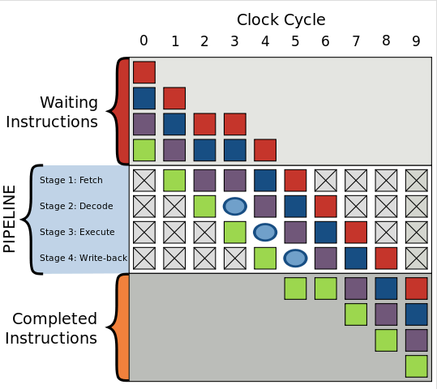
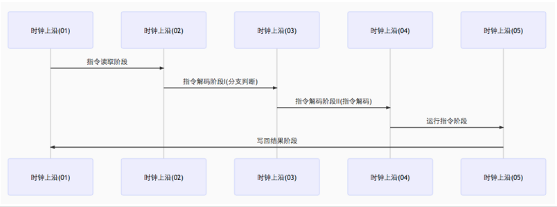
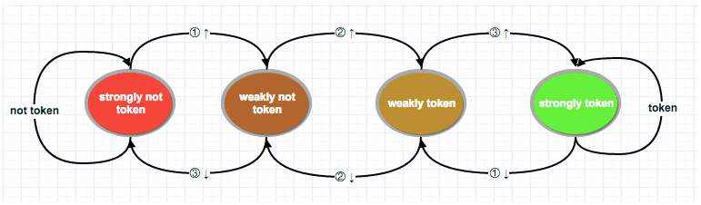

## if else 底层

### CPU的分支预测

​	现在假设你是处理器，当看到分支时，当你并不能决定该如何往下走，你只能暂停运行，等待之前的指令运行结束。然后才能继续沿着正确地路径往下走。

​	要知道，现代编译器是非常复杂的，运行时有着非常长的pipelines， 减速和热启动将耗费巨量的时间。那么，有没有好的办法可以节省这些状态切换的时间呢？你可以猜测分支的下一步走向！这样就引出了分支预测。

> - 如果猜错了，处理器要flush掉pipelines，回滚到之前的分支，然后重新热启动，选择另一条路径。
> - 如果猜对了，处理器不需要暂停，继续往下执行。

​	如果每次都猜错了，处理器将耗费大量时间在停止-回滚-热启动这一周期性过程里。如果侥幸每次都猜对了，那么处理器将从不暂停，一直运行至结束。

​	上述过程就是分支预测(branch prediction)。虽然在现实的道口铁轨切换中，可以通过一个小旗子作为信号来判断火车的走向，但是处理器却无法像火车那样去预知分支的走向--除非最后一次指令运行完毕。

​	那么处理器该采用怎样的策略来用最小的次数来尽量猜对指令分支的下一步走向呢？答案就是分析历史运行记录： 如果火车过去90%的时间都是走左边的铁轨，本次轨道切换，你就可以猜测方向为左，反之，则为右。如果在某个方向上走过了3次，接下来你也可以猜测火车将继续在这个方向上运行...

​	换句话说，你试图通过历史记录，识别出一种隐含的模式并尝试在后续铁道切换的抉择中继续应用它。这和处理器的分支预测原理或多或少有点相似。

​	大多数应用都具有状态良好的(well-behaved)分支，所以现代化的分支预测器一般具有超过90%的命中率。但是面对无法预测的分支，且没有识别出可应用的的模式时，分支预测器就无用武之地了。

### 补充

#### Pipeline

​	先简单说明一下CPU的instruction pipeline(指令流水线)，以下简称pipeline。 Pipieline假设程序运行时有一连串指令要被运行，将程序运行划分成几个阶段，按照一定的顺序并行处理之，这样便能够加速指令的通过速度。

​	绝大多数pipeline都由时钟频率(clock)控制，在数字电路中，clock控制逻辑门电路(logical cicuit)和触发器(trigger), 当受到时钟频率触发时，触发器得到新的数值，并且逻辑门需要一段时间来解析出新的数值，而当受到下一个时钟频率触发时触发器又得到新的数值，以此类推。

​	而借由逻辑门分散成很多小区块，再让触发器链接这些小区块组，使逻辑门输出正确数值的时间延迟得以减少，这样一来就可以减少指令运行所需要的周期。 这对应Pipeline中的各个stages。

​	一般的pipeline有四个执行阶段(execuate stage): 读取指令(Fetch) -> 指令解码(Decode) -> 运行指令(Execute) -> 写回运行结果(Write-back).

#### 分支预测器

​	分支预测器是一种数字电路，在分支指令执行前，猜测哪一个分支会被执行，能显著提高pipelines的性能。

​	条件分支通常有两路后续执行分支，not token时,跳过接下来的JMP指令，继续执行， token时，执行JMP指令，跳转到另一块程序内存去执行。

​	为了说明这个问题，我们先考虑如下问题。

#### 没有分支预测器会怎样？

​	加入没有分支预测器，处理器会等待分支指令通过了pipeline的执行阶段(execuate stage)才能把下一条指令送入pipeline的fetch stage。

​	这会造成流水线停顿(stalled)或流水线冒泡(bubbling)或流水线打嗝(hiccup)，即在流水线中生成一个没有实效的气泡， 如下图所示：

​	图中一个气泡在编号为3的始终频率中产生，指令运行被延迟。

​	Stream hiccup现象在早期的RISC体系结构处理器中常见。

#### 有分支预测期的pipeline

​	我们来看分支预测器在条件分支跳转中的应用。条件分支通常有两路后续执行分支，not token时,跳过接下来的JMP指令，继续执行， token时，执行JMP指令，跳转到另一块程序内存去执行。

​	加入分支预测器后，为避免pipeline停顿(stream stalled)，其会猜测两路分支哪一路最有可能执行，然后投机执行，如果猜错，则流水线中投机执行中间结果全部抛弃，重新获取正确分支路线上的指令执行。可见，错误的预测会导致程序执行的延迟。

​	由前面可知，Pipeline执行主要涉及Fetch, Decode, Execute, Write-back几个stages, 分支预测失败会浪费Write-back之前的流水线级数。现代CPU流水线级数非常长，分支预测失败可能会损失20个左右的时钟周期，因此对于复杂的流水线，好的分支预测器非常重要。

#### 常见的分支预测器

- 静态分支预测器

静态分支预测器有两个解码周期，分别评价分支，解码。即在分支指令执行前共经历三个时钟周期。详情见图：

- 双模态预测器(bimodal predictor)
  也叫饱和计数器，是一个四状态状态机. 四个状态对应两个选择: token, not token， 每个选择有两个状态区分强弱：strongly,weakly。分别是Strongly not taken，Weakly not taken, Weakly taken, Strongly taken。

状态机工作原理图如下：

​	图左边两个状态为不采纳(not token)，右边两个为采纳(token)。由not token到token中间有两个渐变状态。由红色到绿色翻转需要连续两次分支选择。

​	技术实现上可用两个二进制位来表示，00, 01, 10, 11分别对应strongly not token, weakly not token, weakly token, strongly token。 一个判断两个分支预测规则是否改变的简单方法便是判断这个二级制状态高位是否跳变。高位从0变为1， 强状态发生翻转，则下一个分支指令预测从not token变为token，反之亦然。

​	据评测，双模态预测器的正确率可达到93.5%。预测期一般在分支指令解码前起作用。

​	其它常见分支预测器如两级自适应预测器，局部/全局分支预测器，融合分支预测器，Agree预测期，神经分支预测器等。