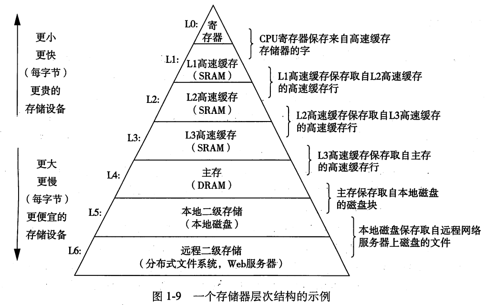

## 计算机系统漫游

### 系统硬件组成

- 总线： 贯穿整个系统的是一组电子管道，用于在各部件间传输字节，而传输的字节是固定的，例如： 32为或是64位，我们常说的你电脑是32位还是64位，指的就是电脑传输的固定字长。
- 主存： 临时存储设备，用于存放程序和程序处理的数据， 由动态随机存取存储器组成（DRAM）.
- CPU:  中央处理器，指挥这数据处理，主要的操作有

### 高级缓存

 	CPU处理数据要是每次都是从主存中读取数据再操作，处理的速度就会过于缓慢，于是在CPU内部使用了高速缓存存储器的设备，其内部使用的是静态随机访问存存器（SRAM）的硬件技术组成。

### 操作系统管理硬件

硬件有两个基本功能：

- 防止硬件被失控的应用程序滥用。
- 向应用程序提供简单一致的机制来控制复杂的硬件设备。

​     为了实现这样的功能，操作系统抽象出了几个概念，进程，虚拟存储器，文件。

- 进程： 形象地理解就是某个程序占用着一定资源的硬件设备。以下是单处理系统切换进程上下文。

- 线程： 进程中执行任务的最小执行单位。

- 虚拟存储器： 为每个进程提供了一个假象，即每个进程都在独占地使用主存。下面举个例子

     假若我们用C语言打印一句 “Hello World ! ”,

​	从下往上介绍：

- 文件： 就是字节序列，仅此而已。